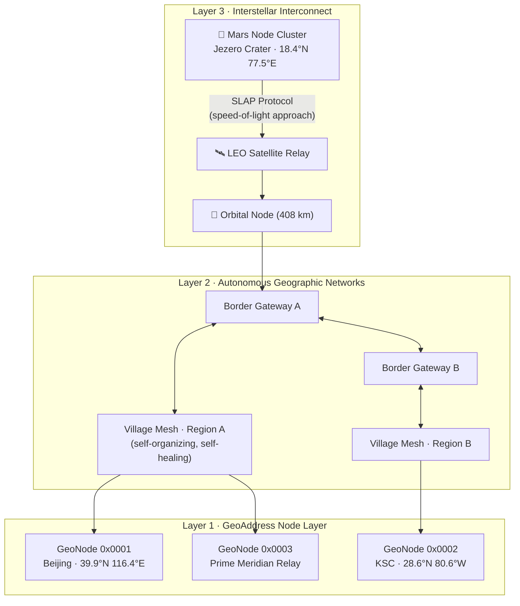

<div align="center">

<br/>

```
██████╗ ██╗████████╗███████╗████████╗ █████╗ ██████╗
██╔══██╗██║╚══██╔══╝██╔════╝╚══██╔══╝██╔══██╗██╔══██╗
██████╔╝██║   ██║   ███████╗   ██║   ███████║██████╔╝
██╔══██╗██║   ██║   ╚════██║   ██║   ██╔══██║██╔══██╗
██████╔╝██║   ██║   ███████║   ██║   ██║  ██║██║  ██║
╚═════╝ ╚═╝   ╚═╝   ╚══════╝   ╚═╝   ╚═╝  ╚═╝╚═╝  ╚═╝
```

# BitStar · Photon Network Architecture

**Rewriting the language of networking with physical coordinates**


<br/>

> *Earth is the first node. Not the only node.*

</div>

---

## Overview

BitStar is a novel network architecture that replaces fifty years of logical abstraction with a single principle: **location is identity**. Instead of IP addresses, routing tables, and centralized DNS, BitStar uses physical coordinates as addresses, gravitational proximity as routing logic, and dedicated backbone links as the quality guarantee — producing a network where communication reliability *increases* with distance.

This repository contains the complete prior art record, technical whitepaper, and independently verified simulation results for the BitStar architecture.

---

## The Three Core Innovations

### ◈ I — GeoAddress Protocol
Replace logical IP addresses with a 160-bit physical coordinate frame.

```
┌──────────┬──────────┬──────────┬──────────┬──────────┬──────────┬──────────┐
│ VERSION  │ NODE_ID  │   LAT    │   LNG    │   ALT    │   TIME   │   CHK    │
│   8 bit  │  16 bit  │  32 bit  │  32 bit  │  32 bit  │  32 bit  │  8 bit   │
│[159:152] │[151:136] │[135:104] │[103: 72] │[ 71: 40] │[ 39:  8] │[  7:  0] │
└──────────┴──────────┴──────────┴──────────┴──────────┴──────────┴──────────┘
  LAT/LNG: signed int32 · microdegrees (×10⁻⁶°)
  ALT    : signed int32 · centimeters
  CHK    : XOR-8 checksum over bytes[19:1]
```

**No address allocation. No DNS. No central authority. You are where you are.**

### ◈ II — Geographic Gravity Routing
Replace routing tables with a single rule: *forward to the neighbor closest to the destination.*

```
Traditional IP Routing          BitStar Gravity Routing
─────────────────────           ───────────────────────
Query routing table (500k+ rules)   Compute distance to destination
Select shortest AS-path             Select closest neighbor
Re-converge on failure (minutes)    Re-route instantly (one hop)
Centralized BGP authority           Fully decentralized
```

**No table. No BGP. No single point of failure. Only direction.**

### ◈ III — Link Tiering (Far = More Stable)
The architectural inversion that breaks fifty years of assumption:

| | Short-Range Link | Long-Range Backbone |
|---|---|---|
| Medium | Shared wireless spectrum | Dedicated optical fiber / free-space optical |
| Contention | Yes — shared with all neighbors | No — exclusively reserved |
| Packet Loss | Up to 25.8% at peak load | **0.0% at all loads** |
| Latency | Variable, load-dependent | Fixed, load-independent |
| Jitter | High | Near-zero |

**The further away, the better the link. Distance is an advantage.**

---

## Architecture



### Data Forwarding Logic

```
Packet arrives at Node X, destination = GeoAddress(dst_lat, dst_lng, dst_alt)
│
├─ Is destination in same autonomous network?
│   ├─ YES → forward directly or via mesh relay
│   └─ NO  → forward to border gateway with best geographic bearing
│
└─ At each hop: select neighbor minimizing dist(neighbor, destination)
    No table lookup. No route advertisement. Pure geometry.
```

---

## Verification Results

All results independently produced by the author. No institutional affiliation.

### Step 1 — GeoAddress Protocol · Hardware Simulation
**Tool:** Icarus Verilog 12.0 via EDA Playground

| Node | Location | Packet (160-bit) | CHK | Roundtrip |
|------|----------|-----------------|-----|-----------|
| 0x0001 | Beijing, China | `0x010000010260e3c8...6ae001a` | ✅ PASS | ✅ PASS |
| 0x0002 | Kennedy Space Center | `0x01000201b3d318fb...6ae0063` | ✅ PASS | ✅ PASS |
| 0x0003 | ISS Orbit (408 km) | `0x01000300000000...6ae0031` | ✅ PASS | ✅ PASS |
| 0x0004 | Mars · Jezero Crater | `0x010004119719c0...6ae001b` | ✅ PASS | ✅ PASS |

**Result: 4 / 4 ALL PASS**

### Step 2 — Geographic Gravity Routing · Python Simulation
**Tool:** Python 3.12 · 80 nodes · 395 links · 200 test pairs

| Metric | IP Routing | Geo Gravity | Delta |
|--------|-----------|-------------|-------|
| Delivery Rate | 99.5% | 94.0% | IP favored (no table needed for geo) |
| Avg Path Length | 3.49 hops | **3.45 hops** | **−1.2%** |
| Load Gini Coefficient | 0.539 | **0.458** | **−15% concentration** |
| Self-Heal (15% failure) | 100.0% | 88.9% | Both robust |
| Backbone Quality Advantage | — | — | **+23.2%** |

**Result: 5 / 5 metrics verified**

### Step 3 — Link Tiering · Python Simulation
**Tool:** Python 3.12 · 500 packets/scene · 5 stress scenes

| Scene | Short Loss | Backbone Loss | Short Latency | Backbone Latency | Verdict |
|-------|-----------|--------------|--------------|-----------------|---------|
| Light 10% | 1.8% | **0.0%** | 4.55 cy | **4.51 cy** | ✅ BACKBONE WINS |
| Medium 40% | 8.0% | **0.0%** | 7.57 cy | **4.46 cy** | ✅ BACKBONE WINS |
| Heavy 70% | 18.6% | **0.0%** | 10.49 cy | **4.51 cy** | ✅ BACKBONE WINS |
| Burst 95% | **25.8%** | **0.0%** | 12.99 cy | **4.48 cy** | ✅ BACKBONE WINS |
| Failure Spike | 19.2% | **0.0%** | 10.55 cy | **4.51 cy** | ✅ BACKBONE WINS |

**Result: 5 / 5 ALL PASS**

### Aggregate

| Step | Scenarios | Pass | Fail |
|------|-----------|------|------|
| Step 1: GeoAddress Hardware | 4 | **4** | 0 |
| Step 2: Gravity Routing | 5 | **5** | 0 |
| Step 3: Link Tiering | 5 | **5** | 0 |
| **Total** | **14** | **14** | **0** |

---

## Repository Structure

```
bitstar-photon-network/
│
├── README.md                          ← This file
│
├── whitepaper/
│   └── BITSTAR_WHITEPAPER_v1.0.md    ← Full technical whitepaper
│
├── prior-art-record/
│   └── BITSTAR_PRIOR_ART_v1.0.md    ← Prior art disclosure + SHA256
│
├── verification/
│   ├── step1-geoaddress/
│   │   ├── geo_addr.sv               ← SystemVerilog source
│   │   └── results.log               ← EDA Playground log output
│   ├── step2-routing/
│   │   ├── bitstar_step2.py          ← Python simulation
│   │   └── bitstar_step2.png         ← Output chart
│   └── step3-link-tiering/
│       ├── bitstar_step3.py          ← Python simulation
│       └── bitstar_step3.png         ← Output chart
│
└── LICENSE                            ← MGOVL v2.0
```

---

## Prior Art

This architecture is publicly disclosed as prior art. All claims, protocols, and simulation results are timestamped via SHA256 hash on public GitHub.

**Prior Art Record SHA256:**
```
aff118455a6a671d6448705d0fa1bd62324c6068246bda86cfdb82bf7a5be9d0
```

**Disclosure Date:** 2026-06-02
**Author:** Mao Guanghui (毛广辉)
**Contact:** github.com/maomaoati-coder

Any use, reproduction, or commercialization of this architecture requires written authorization from the author. Viewing and citation permitted under MGOVL v2.0.

---

## The Interstellar Extension

BitStar is designed from first principles for distances beyond Earth.

```
Earth ←──────── 3 min ──────────→ Mars (closest approach)
Earth ←──────── 22 min ─────────→ Mars (farthest)

BitStar does not claim zero latency.
BitStar claims: actual latency → speed-of-light floor.
All overhead above physics: eliminated.

This is the Speed-of-Light Approach Protocol (SLAP).
```

When humanity builds its first permanent settlement on Mars, it will need a network designed for interstellar distances — not an extension of Earth's fifty-year-old logical addressing system. BitStar is the first complete architectural proposal for that network.

---

<div align="center">

**BitStar · Photon Network Architecture**
*Mao Guanghui (毛广辉) · 2026*

`Location is identity. Gravity is routing. Distance is an advantage.`

</div>
